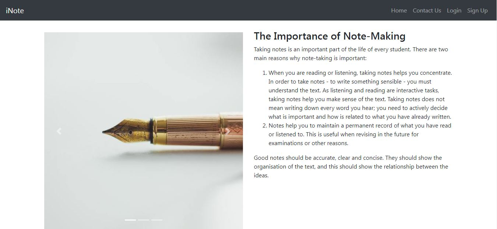
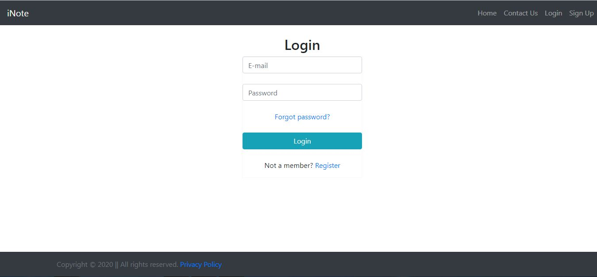
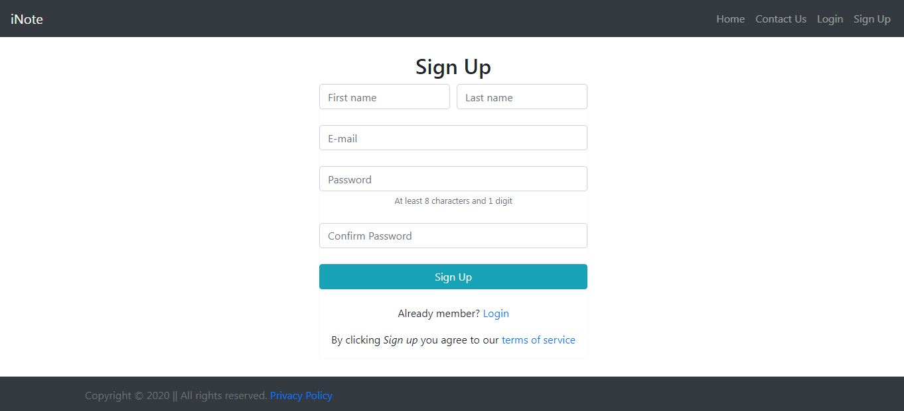
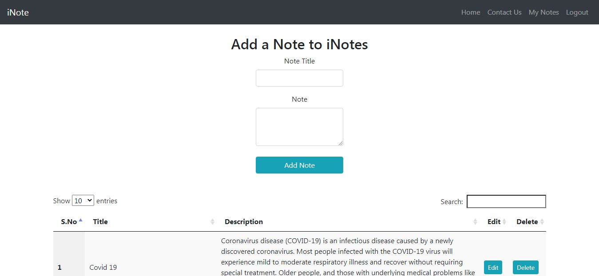
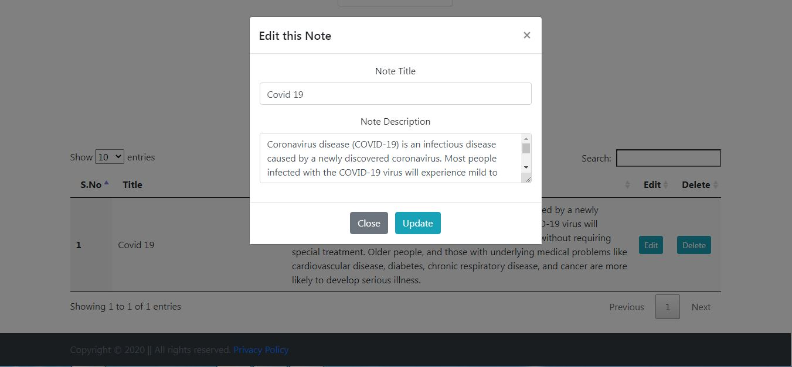
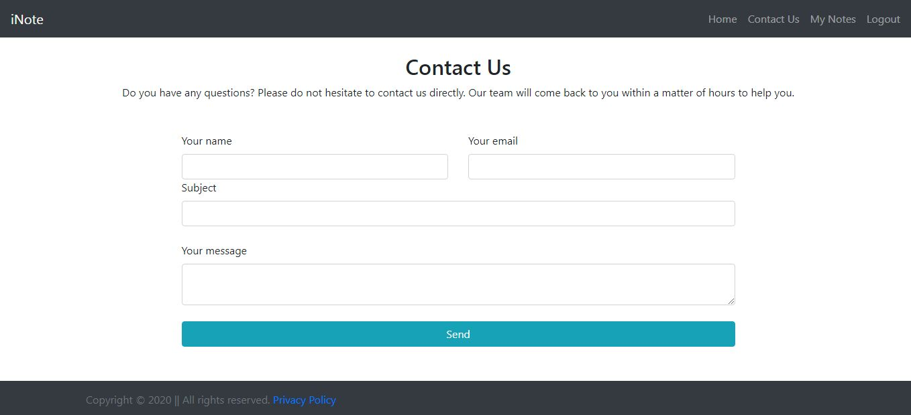

# iNote Application
Notes applications (also known as note-taking apps) allow students to store all notes and valuable information digitally. This Project based on CRUD operation using PDO in php.

Anyone can add, update and delete notes unlimited times. Created by using PHP and mySql for backend and Bootatrap-4 for frontend.

## Project Installation
Follow the steps below should be performed after you’ve started Apache and MySQL server in XAMPP.(windows)
- Extract the File.
- Copy the Main project folder Paste into C:\xampp\htdocs\
- Open a browser and type http://localhost/phpmyadmin/ into the address bar.
- After that go to the databases tab.
- Name your database "inote" and then go to the import tab.
- Upload SQL File From Project folder.
- Go to http://localhost/iNote/

## Screenshots

## Developed By
- Swarup Kanade [@swarupkanade](https://www.github.com/swarupkanade)
- Omkar Kanade [@omkarkanade](https://www.github.com/omkarkanade)
